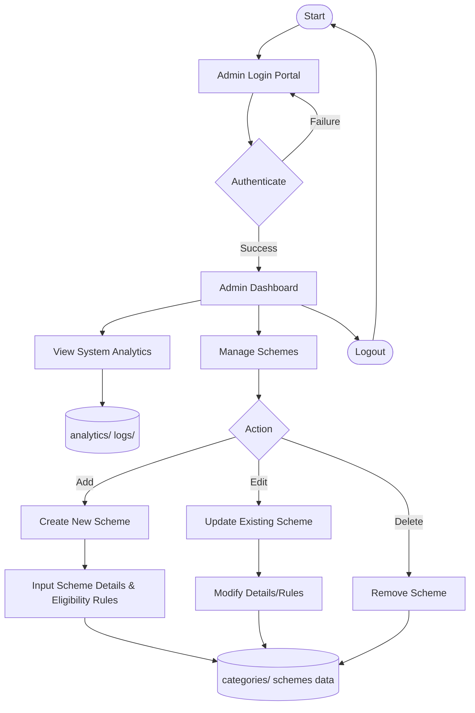

# Admin Dataflow

The following diagram illustrates the dataflow and operations available to an Administrator within the SchemeSetu platform.

### Key Processes:
1. **Admin Authentication**: Administrators log in using specific credentials verified against `admin.json`.
2. **Dashboard & Analytics**: Admins can view platform usage statistics and metrics fetched from the `analytics` data folder.
3. **Scheme Management**: The core admin function. Admins can perform CRUD (Create, Read, Update, Delete) operations on the central scheme repository, updating the underlying JSON data files so that changes instantly reflect on the user-facing portal.
