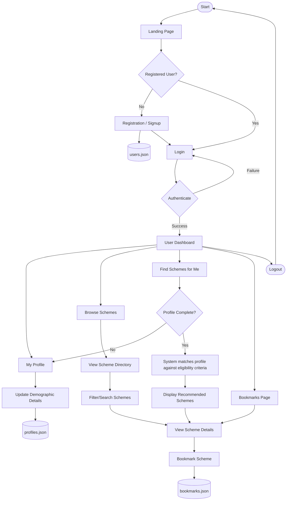

# User Dataflow

The following diagram illustrates the typical dataflow and user journey within the SchemeSetu platform for a standard user.

### Key Processes:
1. **Authentication Flow**: Users register or log in. Their credentials are saved and verified against the JSON-based datastore (`users.json`).
2. **Profile Management**: Users can update their demographic details (age, gender, income, state, etc.), which are saved in `profiles.json` and used for eligibility checks.
3. **Scheme Discovery**: Users can manually browse schemes or use the "Find Schemes for Me" feature, which calculates matches based on their profile and dynamically generated questionnaires.
4. **Bookmarking**: Users can save schemes of interest to their bookmarks, which persist across sessions via `bookmarks.json`.
